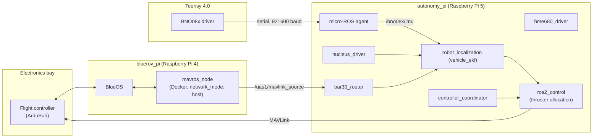

# RDML BlueROV2 Deployment

This repository hosts the onboard software stack used to deploy the Robotic Decision Making
Lab's (RDML) BlueROV2 Heavy: the ROV, companion computer, and microcontroller configuration;
the ROS 2 packages that run on the vehicle; and the deployment scripts and systemd services
that bring it all up on hardware.

* * *

## Hardware

### ROV Platform

- BlueROV2 Heavy, with an additional payload bottle for autonomy compute
- Reach Alpha 5 manipulator

### Compute

| Device                    | Role                                         | Operating System                |
| -------------------------- | -------------------------------------------- | -------------------------------- |
| Raspberry Pi 4 (`bluerov_pi`)  | BlueOS companion computer, MAVLink&#8596;ROS 2 bridge | Raspberry Pi OS Lite (Bookworm) |
| Raspberry Pi 5 (`autonomy_pi`) | Primary ROS 2 autonomy stack                 | Ubuntu 24.04 Server              |
| Teensy 4.0                 | IMU driver, streamed into the ROS 2 graph via micro-ROS | Teensyduino                      |
| NVIDIA Jetson Orin Nano     | Onboard compute                              | Ubuntu 22.04                     |

### Additional Sensors

- Nortek Nucleus 1000 (DVL)
- Blueprint SeaTrac USBL
- Water Linked UGPS
- Oculus sonar
- Bosch BME680 (environmental sensing)
- BNO085 IMU, interfaced via the [Teensy firmware](hardware/teensy)

### Cameras

- Deep Water stellarHD cameras (subconn connectors)
- Barlus underwater cameras

* * *

## System Architecture

The vehicle runs two separate ROS 2 graphs that meet at a single bridge point: MAVLink, routed
between the flight controller and `autonomy_pi` through a Dockerized MAVROS on `bluerov_pi`. The
Teensy joins the `autonomy_pi` graph directly over serial via a micro-ROS agent.



`bluerov_pi` and `autonomy_pi` are separate hosts on the same subnet; see
[`docs/networking.md`](docs/networking.md) for addresses and credentials, and
[`docs/hardware.md`](docs/hardware.md) for the operating system on each device.

* * *

## Firmware and Software

### BlueOS Configuration

`bluerov_pi` runs BlueOS for flight-controller management, video streaming, and general vehicle
telemetry. A Dockerized MAVROS (`hardware/bluerov_pi/docker`) bridges MAVLink traffic into ROS 2
over the host network, publishing raw MAVLink messages that `autonomy_pi` consumes (e.g.,
`bar30_router` extracts depth from `SCALED_PRESSURE2`). See
[`hardware/bluerov_pi`](hardware/bluerov_pi) for the Docker Compose configuration, systemd unit,
and install script.

### ROS 2 Configuration

`autonomy_pi` hosts the primary ROS 2 autonomy stack, launched via
[`autonomy_bringup`](hardware/autonomy_pi/ros/autonomy_bringup) and brought up on boot by
[`ros.service`](hardware/autonomy_pi/services/ros.service). It combines packages developed in
this repository with packages pulled in from other RDML repositories at build time via
[`pi.repos`](hardware/autonomy_pi/ros/pi.repos):

| Package                | Source              | Purpose                                            |
| ----------------------- | -------------------- | --------------------------------------------------- |
| `autonomy_bringup`      | this repository      | Launch files for the autonomy stack                 |
| `autonomy_description`  | this repository      | URDF, `ros2_control`, and EKF/controller configuration |
| `autonomy_routers`      | this repository      | Routes MAVLink topics (e.g., pressure) onto ROS 2 topics |
| [`hydrodynamics`](https://github.com/Robotic-Decision-Making-Lab/hydrodynamics)       | Robotic-Decision-Making-Lab | Hydrodynamic modeling                        |
| [`auv_controllers`](https://github.com/Robotic-Decision-Making-Lab/auv_controllers)     | Robotic-Decision-Making-Lab | `ros2_control` controllers for AUVs/ROVs     |
| [`bme680`](https://github.com/Robotic-Decision-Making-Lab/bme680)               | Robotic-Decision-Making-Lab | BME680 environmental sensor driver           |
| [`nortek_dvl`](https://github.com/Robotic-Decision-Making-Lab/nortek_dvl)           | Robotic-Decision-Making-Lab | Nortek Nucleus DVL driver                    |
| [`mavros_thruster_hardware`](https://github.com/Robotic-Decision-Making-Lab/mavros_thruster_hardware) | Robotic-Decision-Making-Lab | `ros2_control` hardware interface for MAVROS-driven thrusters |

State estimation is handled by `robot_localization`, fusing the Teensy's IMU, the Nucleus DVL,
and MAVLink-derived depth (see
[`autonomy_description/config/ekf.yaml`](hardware/autonomy_pi/ros/autonomy_description/config/ekf.yaml)).
Thruster control runs through `ros2_control` with a `thruster_hardware/ThrusterHardware` plugin,
allocated and coordinated by `auv_controllers` and `controller_coordinator`
(`hardware/autonomy_pi/ros/autonomy_bringup/launch/controllers.launch.py`).

### Teensy Firmware

The [`hardware/teensy`](hardware/teensy) directory is a PlatformIO project for a Teensy 4.0 that
reads a BNO085 IMU over I2C and publishes `sensor_msgs/Imu` on `/bno08x/imu` via micro-ROS,
bridged into the `autonomy_pi` ROS 2 graph over serial by `microros.service`.

* * *

## Getting Started

Each device is provisioned by its own install script, which sets up the ROS 2 workspace,
system dependencies, and systemd services:

- `bluerov_pi`: [`hardware/bluerov_pi/scripts/install.sh`](hardware/bluerov_pi/scripts/install.sh)
- `autonomy_pi`: [`hardware/autonomy_pi/scripts/install.sh`](hardware/autonomy_pi/scripts/install.sh)

The Teensy firmware is built and flashed with [PlatformIO](https://platformio.org/):

```bash
cd hardware/teensy
pio run -t upload
```

* * *

## License

This project is licensed under the [MIT License](LICENSE).
