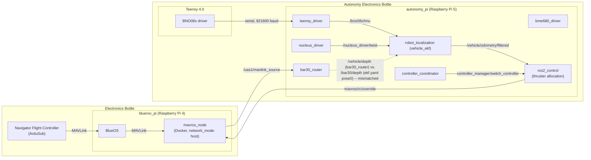

# RDML BlueROV2 Deployment

This repository hosts the onboard software stack used to deploy the Robotic
Decision Making Lab's (RDML) BlueROV2.

---

## Hardware

### ROV Platform

- [BlueROV2](https://bluerobotics.com/store/rov/bluerov2/) (Blue Robotics) -- Heavy Configuration with 150 m tether
- Navigator Flight Controller (with Raspberry Pi 4, 8 GB)
- [Alpha 5](https://reachrobotics.com/products/reach-alpha) (Reach Robotics)
- Modifications: payload bay equipped with additional compute and sensing capabilities

### Compute

| Device                                | Operating System                |
| ------------------------------------- | ------------------------------- |
| Raspberry Pi 4, 16 GB (`bluerov_pi`)  | Raspberry Pi OS Lite (Bookworm) |
| Raspberry Pi 5, 16 GB (`autonomy_pi`) | Ubuntu 26.04 Server             |
| Teensy 4.0                            | Teensyduino                     |
| NVIDIA Jetson Orin Nano               | Ubuntu 22.04                    |

### Additional Sensors

- [Nucleus 1000 DVL](https://www.nortekgroup.com/products/nucleus1000) (Nortek)
- [SeaTrac Lightweight USBL](https://www.blueprintsubsea.com/seatrac/seatrac-lightweight) (Blueprint Subsea)
- [Oculus Sonar](https://www.blueprintsubsea.com/oculus/) (Blueprint Subsea)

### Cameras

- [stellarHD](https://dwe.ai/products/stellarhd) (Deep Water Exploration)

### Topside

- See our corresponding [topside repository](https://github.com/Robotic-Decision-Making-Lab/RDML_BlueROV2_Topside)

---

## System Architecture



> The dashed `bar30_router` &#8594; `robot_localization` edge above is not a
> typo: `bar30_router` currently publishes depth on `/vehicle/depth`
> ([`routes.yaml`](modules/autonomy_pi/ros/autonomy_description/config/routes.yaml)),
> but `vehicle_ekf`'s `pose0` still points at `/bar30/depth`
> ([`ekf.yaml`](modules/autonomy_pi/ros/autonomy_description/config/ekf.yaml)) --
> the EKF is not currently receiving depth.

---

## Networking

| Device                         | IP Address      | Username  | Password         |
| ------------------------------ | --------------- | --------- | ---------------- |
| Raspberry Pi 4 (`bluerov_pi`)  | `192.168.2.2`   | `pi`      | `REDACTED`      |
| Raspberry Pi 5 (`autonomy_pi`) | `192.168.2.3`   | `REDACTED` | `REDACTED`        |
| Barlus Underwater Camera (New) | `192.168.2.20`  | `N/A`     | `N/A`            |
| Barlus Underwater Camera (Old) | `192.168.2.11`  | `N/A`     | `N/A`            |
| NVIDIA Jetson Orin Nano        | `192.168.55.1`  | `rdml`    | `REDACTED` |
| Nortek Nucleus 1000            | `192.168.2.201` | `N/A`     | `REDACTED`         |

---

## Wiring & GPIO

### Teensy 4.0

| Signal               | Pin / value                                        |
| -------------------- | -------------------------------------------------- |
| I2C SDA              | 18                                                 |
| I2C SCL              | 19                                                 |
| BNO08x INT           | 2                                                  |
| BNO08x RST           | 3                                                  |
| I2C addr             | `0x4A`                                             |
| UART → `autonomy_pi` | `Serial1`, 921600 baud → Pi UART0 (`/dev/ttyAMA0`) |
| USB debug            | `Serial`, 9600 baud                                |

### Autonomy Pi GPIO

| Device                                 | GPIO                                     |
| -------------------------------------- | ---------------------------------------- |
| `arm1`                                 | 24                                       |
| `arm2`                                 | 25                                       |
| `sonar`                                | 26                                       |
| `dvl`                                  | 27                                       |
| PLD (power-loss detect, `pld_monitor`) | 6 — no debounce, 1 low sample = shutdown |

---

## Firmware and Software

### BlueOS Configuration

- ArduSub: vX.X.X <!-- TODO: confirm flashed version -->
- BlueOS's MAVLink router is configured with an additional UDP endpoint, in the **MAVLink
  Endpoints** page, targeting `127.0.0.1:14755`. This mirrors the flight controller's MAVLink
  stream to the `mavros_node` container (`network_mode: host`), which listens on that port per
  its `fcu_url` in [`mavros.yaml`](modules/bluerov_pi/docker/mavros.yaml).

### ROS 2 Configuration

- ROS 2 Lyrical
- MAVROS is loaded by default on the `bluerov_pi` via [service](modules/bluerov_pi/services/ros.service)
- The control, state estimation, and other autonomy-level components can be configured and launched via [`autonomy_description`](modules/autonomy_pi/ros/autonomy_description), respectively and [`autonomy_bringup`](modules/autonomy_pi/ros/autonomy_bringup)

---

## Getting Started

Each device is provisioned by its own install script, which sets up the ROS 2 workspace,
system dependencies, and systemd services:

- `bluerov_pi`: [`modules/bluerov_pi/scripts/install.sh`](modules/bluerov_pi/scripts/install.sh)
- `autonomy_pi`: [`modules/autonomy_pi/scripts/install.sh`](modules/autonomy_pi/scripts/install.sh)

The Teensy firmware is built and flashed with [PlatformIO](https://platformio.org/):

```bash
cd modules/teensy
pio run -t upload
```

---

## Citation

This repository has been used in the following papers:

```bibtex
@article{palmer2026stochastic,
  title         = {{Stochastic Physics-Informed Neural Networks on Lie Groups for Learning Underwater Vehicle Dynamics}},
  author        = {Palmer, Evan F. and Hatton, Ross L. and Hollinger, Geoffrey A.},
  journal       = {arXiv preprint arXiv:2608.08356},
  year          = {2026},
  eprint        = {https://doi.org/10.48550/arXiv.2608.08356},
  archivePrefix = {arXiv},
  primaryClass  = {cs.RO},
}
```

## License

This project is licensed under the [MIT License](LICENSE).
